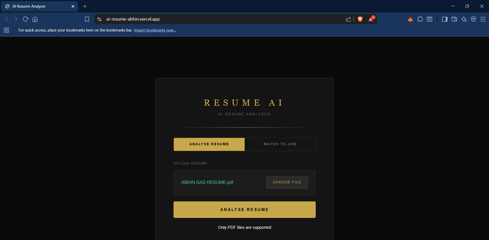
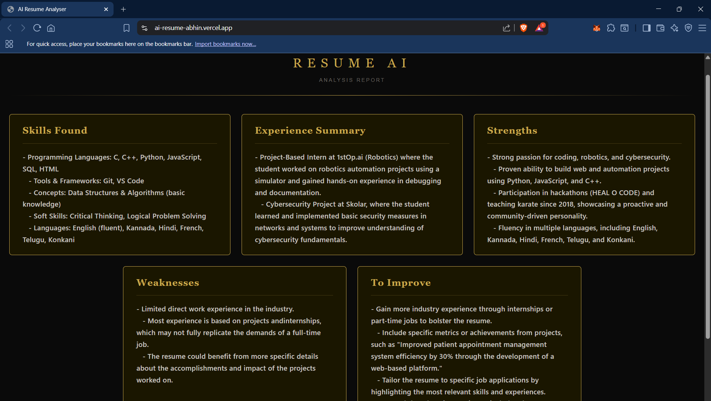
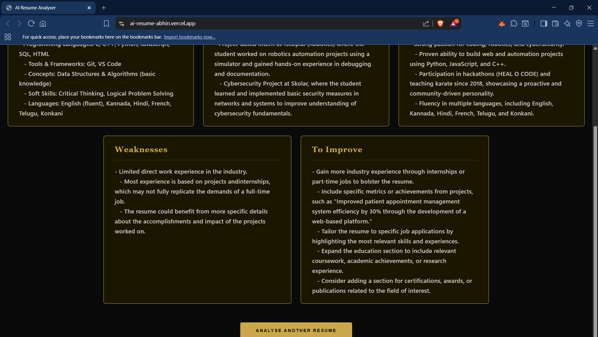
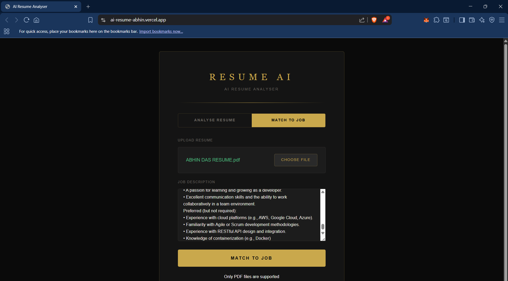
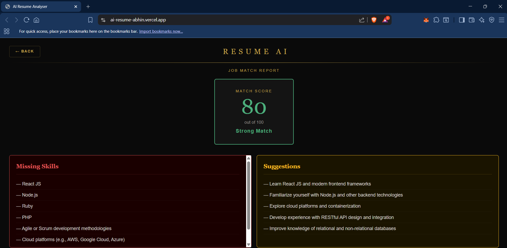
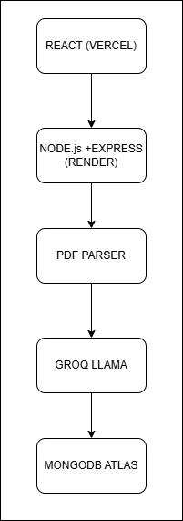

# RESUME AI — AI Resume Analyzer & ATS Job Matcher

A full-stack web application that uses AI to analyse resumes and match them against job descriptions. Generates structured analysis across 5 categories and computes ATS-style job match scores out of 100.

**Demo:** [ai-resume-abhin.vercel.app](https://ai-resume-abhin.vercel.app)

---

## Screenshots

### Upload Page


### Resume Analysis




### Job Match




---

## Architecture



## Features

- **Resume Analysis** — Generates structured analysis across 5 categories: Skills Found, Experience Summary, Strengths, Weaknesses, and Suggestions to Improve
- **Job Match** — Computes an ATS-style match score (0–100) against a job description, identifies missing skills, and provides targeted suggestions
- **Smart Validation** — Detects non-resume PDFs and fake job descriptions before processing, preventing wasted API calls
- **Duplicate Prevention** — Re-uploading a resume with the same filename updates the existing record instead of creating duplicates
- **Persistent State** — Results survive page refresh via sessionStorage, cleared automatically when browser is closed
- **Mobile Responsive** — Fully functional across phones, tablets, and desktops with adaptive UI based on device

---

## Tech Stack

| Layer | Technology |
|---|---|
| Frontend | React, Tailwind CSS, Vite |
| Backend | Node.js, Express.js |
| Database | MongoDB Atlas |
| AI Model | Groq API — LLaMA 3.3 70B Versatile |
| PDF Parsing | pdf2json |
| Deployment (Frontend) | Vercel |
| Deployment (Backend) | Render |

---

## Project Structure

```
AIRESUME/
├── frontend/
│   ├── src/
│   │   ├── pages/
│   │   │   ├── UploadPage.jsx        # Upload page with Analyse and Match tabs
│   │   │   ├── ResultPage.jsx        # Resume analysis results across 5 cards
│   │   │   └── MatchResultPage.jsx   # Job match score, missing skills, suggestions
│   │   ├── App.jsx                   # Main app router with session persistence
│   │   └── index.css                 # Global styles
│   ├── index.html
│   └── package.json
│
├── backend/
│   ├── routes/
│   │   └── resume.js                 # /upload and /match API routes
│   ├── models/
│   │   └── Resume.js                 # MongoDB schema
│   ├── uploads/                      # Temporary PDF storage
│   ├── index.js                      # Express server entry point
│   └── package.json
│
└── README.md
```

---

## Getting Started (Run Locally)

### Prerequisites

Make sure you have the following installed:
- [Node.js](https://nodejs.org) v22.12 or higher
- [MongoDB Community Server](https://www.mongodb.com/try/download/community)
- [Git](https://git-scm.com)

You will also need accounts and API keys for:
- [MongoDB Atlas](https://mongodb.com/atlas) — free cloud database
- [Groq API](https://console.groq.com) — free AI API key

---

### Step 1 — Clone the Repository

```bash
git clone https://github.com/abhin012/AI-RESUME.git
cd AI-RESUME
```

---

### Step 2 — Set up the Backend

```bash
cd backend
npm install
```

Create a `.env` file inside the `backend` folder:

```
PORT=5000
MONGO_URI=mongodb://127.0.0.1:27017/resumeanalyser
GROQ_API_KEY=your_groq_api_key_here
```

> For local development, `MONGO_URI` points to your local MongoDB.
> Replace `your_groq_api_key_here` with your actual key from [console.groq.com](https://console.groq.com)

---

### Step 3 — Set up the Frontend

Open a new terminal:

```bash
cd frontend
npm install
```

---

### Step 4 — Run the App

You need **3 terminals** running at the same time:

**Terminal 1 — Start MongoDB:**
```bash
mongod --dbpath C:\data\db
```

**Terminal 2 — Start Backend:**
```bash
cd backend
node index.js
```

You should see:
```
MongoDB connected
Server running on port 5000
```

**Terminal 3 — Start Frontend:**
```bash
cd frontend
npm run dev
```

Open your browser at:
```
http://localhost:5173
```

---

## How to Use

### Analyse Resume
1. Click the **Analyse Resume** tab
2. Click **Choose File** and select your resume PDF
3. Click **Analyse Resume**
4. View your structured analysis across 5 categories — Skills, Experience Summary, Strengths, Weaknesses, To Improve

### Match to Job
1. Click the **Match to Job** tab
2. Upload your resume PDF
3. Paste a real job description in the text area
4. Click **Match to Job**
5. View your ATS-style Match Score out of 100, Missing Skills, and targeted Suggestions

---

## API Endpoints

| Method | Endpoint | Description |
|---|---|---|
| POST | `/api/resume/upload` | Accepts PDF, extracts text, runs AI analysis, saves to MongoDB |
| POST | `/api/resume/match` | Accepts PDF + job description, returns match score and missing skills |

---

## Deployment

### Frontend — Vercel
1. Push code to GitHub
2. Go to [vercel.com](https://vercel.com) → New Project → Import your repo
3. Set Root Directory to `frontend`
4. Deploy

### Backend — Render
1. Go to [render.com](https://render.com) → New Web Service → Connect your repo
2. Set Root Directory to `backend`
3. Set Build Command to `npm install`
4. Set Start Command to `node index.js`
5. Add Environment Variables:
   - `PORT` = `10000`
   - `MONGO_URI` = your MongoDB Atlas connection string
   - `GROQ_API_KEY` = your Groq API key

### Database — MongoDB Atlas
1. Create a free cluster at [mongodb.com/atlas](https://mongodb.com/atlas)
2. Create a database user
3. Allow network access from anywhere (`0.0.0.0/0`)
4. Get your connection string and use it as `MONGO_URI`

---

## Environment Variables

| Variable | Description |
|---|---|
| `PORT` | Port the server runs on (5000 locally, 10000 on Render) |
| `MONGO_URI` | MongoDB connection string |
| `GROQ_API_KEY` | Groq API key for AI analysis |

---

## Notes

- Only PDF files are supported for upload
- The Render free tier sleeps after 15 minutes of inactivity — first request after that may take 30–60 seconds to wake up
- Results persist on page refresh but clear when the browser is closed
- Re-uploading a resume with the same filename replaces the existing record in the database
- Job descriptions under 50 characters are rejected as invalid before any API call is made

---

## Author

**Abhin G Das**
- GitHub: [@abhin012](https://github.com/abhin012)
- LinkedIn: [abhin-das](https://www.linkedin.com/in/abhin-das)

---

## License


This project is open source and available under the [MIT License](LICENSE).


